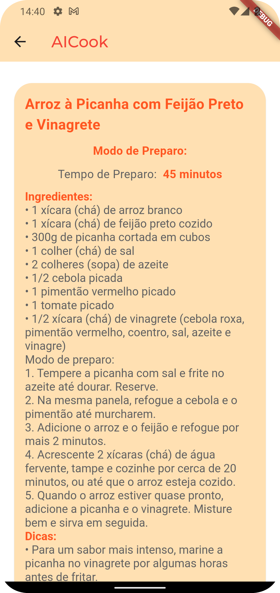

# AICook: Receitas Inteligentes para Sua Cozinha

Um aplicativo Flutter dinâmico que revoluciona a maneira como você cozinha. Com base nos ingredientes que você tem em casa, o AICook utiliza a API do Gemini para gerar receitas personalizadas e deliciosas.

## 📑 Table of Contents

- [Screenshots](#screenshots)
- [Dependências](#dependências)
- [Instalação](#instalação)
- [Recursos](#recursos)
- [Como Usar](#como-usar)
- [Contribuições](#contribuições)
- [Licença](#licença)

## 📌 Screenshots

<div style="display:flex; justify-content:center;">   
  
  
  
  
  
</div>

## 🔗 Dependências

Para usar este aplicativo, você precisa ter as seguintes dependências instaladas:

```yaml
dependencies:
cupertino_icons: ^1.0.6
google_fonts: ^6.2.1
google_generative_ai: ^0.3.2
provider: ^6.1.2
flutter_dotenv: ^5.1.0
semaphore: ^0.2.1
http: ^1.2.1
google_translator: ^1.0.0
flutter_launcher_icons: ^0.13.1
flutter_native_splash: ^2.4.0
fluttertoast: ^8.2.5
connectivity_plus: ^6.0.3
```

## 🚀 Instalação

1. Clonar o Repositório:

```bash
git clone https://github.com/dgirotto0/bora_cozinhar.git
```

2. Navegar para o Diretório do Projeto:

```bash
cd bora_cozinhar
```

3. Instalar as Dependências:

```bash
flutter pub get
```

4. Adicionar as credenciais da API Gemini:

```bash
GEMINI_API_KEY=sua_chave_api
```

5. Executar o App:

```bash
flutter run
```

## ✨ Recursos

- **Gerador Inteligente de Receitas:** Digite os ingredientes disponíveis na sua cozinha e o AICook irá gerar receitas criativas e saborosas.
- **Interface Moderna e Intuitiva:** Desfrute de uma experiência de usuário amigável com cards de receitas visualmente atraentes e fáceis de navegar.
- **Suporte Multilíngue:** Disponível em Português e Inglês para atender a todos os cozinheiros.
- **Integração com a API Gemini:** Garante receitas inovadoras e personalizadas com base nos seus ingredientes.

## 🛠️ Como Usar

1. Abra o aplicativo AICook.
2. Digite os ingredientes que você tem disponível na sua cozinha.
3. Clique em "Gerar Receitas".
4. Explore as receitas personalizadas geradas pelo AICook, com informações detalhadas e instruções fáceis de seguir.
5. Experimente novas receitas e impressione seus amigos e familiares com suas habilidades culinárias!

## 🤝 Contribuições

Contribuições são bem-vindas! Para contribuir com o AICook, por favor, siga os seguintes passos:

1. Faça um fork do repositório.
2. Crie um novo branch para sua funcionalidade.
3. Faça as alterações necessárias.
4. Execute os testes para garantir que todas as funcionalidades estão funcionando.
5. Abra um pull request para o branch principal.

## 📧 Entre em contato

Para obter mais informações ou para relatar quaisquer problemas, entre em contato com o desenvolvedor através do email [dgirotto00@gmail.com].
